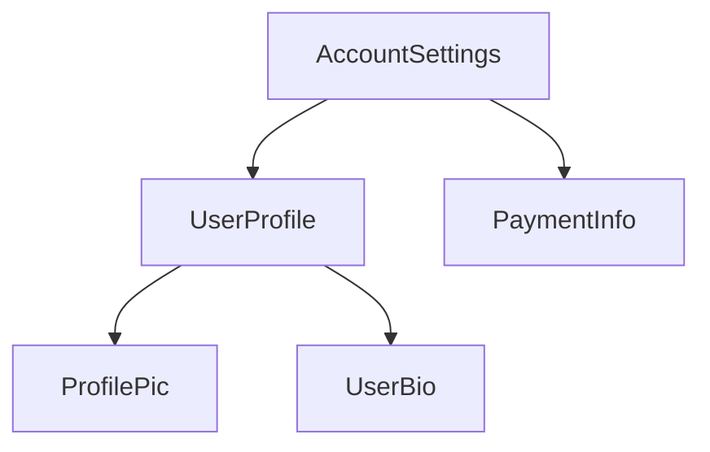

### Imports in the `@Component` decorator

To use a component, [directive](guide/directives), or [pipe](guide/templates/pipes), you must add
it to the `imports` array in the `@Component` decorator:

```angular-ts
import {ProfilePhoto} from './profile-photo';

@Component({
  // Import the `ProfilePhoto` component in
  // order to use it in this component's template.
  imports: [ProfilePhoto],
  /* ... */
})
export class UserProfile { }
```

By default, Angular components are *standalone*, meaning that you can directly add them to the `imports` array of other components. Components created with an earlier version of Angular may instead specify `standalone: false` in their `@Component` decorator. For these components, you instead import the `NgModule` in which the component is defined. See the full [`NgModule` guide](guide/ngmodules) for details.

Important: In Angular versions before 19.0.0, the `standalone` option defaults to `false`.

### Showing components in a template

Every component defines a [CSS selector](https://developer.mozilla.org/docs/Learn/CSS/Building_blocks/Selectors):

<docs-code language="angular-ts" highlight="[2]">
@Component({
  selector: 'profile-photo',
  ...
})
export class ProfilePhoto { }
</docs-code>

See [Component Selectors](guide/components/selectors) for details about which types of selectors Angular supports and guidance on choosing a selector.

You show a component by creating a matching HTML element in the template of _other_ components:

<docs-code language="angular-ts" highlight="[8]">
@Component({
  selector: 'profile-photo',
})
export class ProfilePhoto { }

@Component({
  imports: [ProfilePhoto],
  template: `<profile-photo />`
})
export class UserProfile { }
</docs-code>

Angular creates an instance of the component for every matching HTML element it encounters. The DOM element that matches a component's selector is referred to as that component's **host element**. The contents of a component's template are rendered inside its host element.

The DOM rendered by a component, corresponding to that component's template, is called that
component's **view**.

In composing components in this way, **you can think of your Angular application as a tree of components**.




This tree structure is important to understanding several other Angular concepts, including [dependency injection](guide/di) and [child queries](guide/components/queries).
